  <picture>
    <source media="(prefers-color-scheme: dark)" srcset="dark.svg">
    <source media="(prefers-color-scheme: light)" srcset="light.svg">
    
  </picture>

  <a href="https://github.com/bhuvanabcs24-maker" target="_blank" rel="noopener noreferrer">
    <picture>
      <source media="(prefers-color-scheme: dark)" srcset="https://github-readme-stats-teal-alpha-50.vercel.app/api?username=bhuvanabcs24-maker&show_icons=true&hide_rank=true&include_all_commits=true&count_private=true&disable_animations=true&bg_color=0c1427&title_color=38bdf8&text_color=94a3b8&icon_color=38bdf8&border_color=1e293b&border_radius=12">
      <source media="(prefers-color-scheme: light)" srcset="https://github-readme-stats-teal-alpha-50.vercel.app/api?username=bhuvanabcs24-maker&show_icons=true&hide_rank=true&include_all_commits=true&count_private=true&disable_animations=true&bg_color=ffffff&title_color=0284c7&text_color=475569&icon_color=0284c7&border_color=cbd5e1&border_radius=12">
      
    </picture>
  </a>
  <a href="https://github.com/bhuvanabcs24-maker" target="_blank" rel="noopener noreferrer">
    <picture>
      <source media="(prefers-color-scheme: dark)" srcset="https://github-readme-stats-teal-alpha-50.vercel.app/api/top-langs/?username=bhuvanabcs24-maker&layout=compact&langs_count=6&disable_animations=true&bg_color=0c1427&title_color=38bdf8&text_color=94a3b8&border_color=1e293b&border_radius=12">
      <source media="(prefers-color-scheme: light)" srcset="https://github-readme-stats-teal-alpha-50.vercel.app/api/top-langs/?username=bhuvanabcs24-maker&layout=compact&langs_count=6&disable_animations=true&bg_color=ffffff&title_color=0284c7&text_color=475569&border_color=cbd5e1&border_radius=12">
      
    </picture>
  </a>

  <picture>
    <source media="(prefers-color-scheme: dark)" srcset="https://raw.githubusercontent.com/bhuvanabcs24-maker/bhuvanabcs24-maker/output/github-contribution-grid-snake-dark.svg">
    <source media="(prefers-color-scheme: light)" srcset="https://raw.githubusercontent.com/bhuvanabcs24-maker/bhuvanabcs24-maker/output/github-contribution-grid-snake.svg">
    
  </picture>

